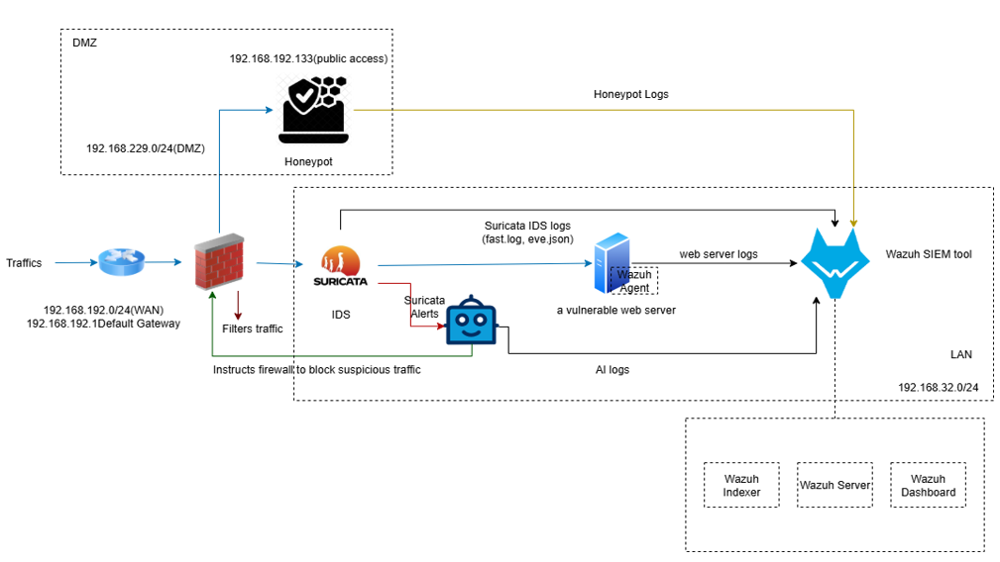

# Deception-Network-Defense

Lab demonstrating **proactive deception** (web honeypot in DMZ), **reactive detection** (Suricata IDS on LAN), and **centralized analysis** (Wazuh SIEM). The design follows a segmented **WAN-DMZ-LAN** topology with a virtual gateway, NAT, and restrictive firewall policies.

> This repository mirrors the lab architecture implemented in the accompanying report and demo. It focuses on a Dockerized **StrutsHoneypot** on Ubuntu (DMZ), Suricata in IDS mode (LAN), and Wazuh (OVA) for log collection, analysis, and ATT&CK-aligned investigation.

## Architecture Overview

```
[WAN (VMNet10, NAT)]  ─┐
                       │  DNAT tcp/80 → 192.168.229.128:8080 (DMZ honeypot)
[Gateway Host: Ubuntu]─┼──────────────────────────────┐
  - ens37: WAN (e.g., 192.168.192.133)                │
  - ens38: DMZ 192.168.229.0/24  (honeypot)           │
  - ens33: LAN 192.168.32.0/24   (Suricata, Wazuh)    │
  - docker0: 172.17.0.0/16 (container bridge)         │
  - IPv4 forwarding enabled                           │
                                                      ▼
[DMZ (VMNet1)]  → StrutsHoneypot (Docker) → logs → Wazuh (via agent)
[LAN (VMNet0)]  → Suricata (IDS mode, EVE JSON) → Wazuh (ingest & dashboards)
               → Local web server 
               → AI module 
```

## Network Topology

The lab uses a three-zone design (**WAN – DMZ – LAN**) with a virtual gateway providing strict inter-zone filtering.



- **Honeypot:** StrutsHoneypot container bound to `192.168.229.128:8080` in DMZ.
- **External access:** DNAT from `WAN:tcp/80` to DMZ:8080.
- **Wazuh:** Official OVA (manager/indexer/dashboards) on LAN.
- **Suricata:** IDS mode on LAN interface with EVE JSON enabled.
- **Isolation:** Strict inter-zone firewall. Only required flows permitted.

## Quick Start

### 1) Spin up the honeypot (DMZ)
```
git clone https://github.com/HsuShunLae/Deception-Network-Defense.git
cd Deception-Network-Defense/honeypot
make all
```

The container exposes HTTP internally and is mapped to `192.168.229.128:8080`. Use gateway DNAT to allow `WAN:80` → `DMZ:8080`.

### 2) Configure Wazuh agent (on the Ubuntu gateway)
See `wazuh/ossec-agent.conf.snippet.xml` and add monitored log paths for the honeypot:
- `/var/log/struts-honeypot/access.log`
- `/var/log/struts-honeypot/error.log`

### 3) Enable Suricata (IDS) on LAN
Install Suricata on the LAN sensor host and apply the sample `suricata/suricata.yaml`. Ensure EVE JSON writes to a path Wazuh can ingest (e.g., via Filebeat or Wazuh agent).

### 4) Generate traffic from WAN (Kali)
- Recon: `nikto -h http://<WAN_ip>/`
- Exploit demo: Use the StrutsHoneypot test scripts `./test-struts2.py http://<WAN_ip>`.

### 5) Investigate in Wazuh
- Dashboards: alerts, HTTP activity, and archive indices for full log search.
- Build DQL/Kibana queries around honeypot fields to isolate patterns.

## Repo Map

- `honeypots/strutshoneypot/` – Dockerized web honeypot, Apache-style logs
- `suricata/` – IDS configuration (EVE JSON, AF_PACKET example)
- `wazuh/` – Agent config snippet + index/dashboards guidance
- `network/` – iptables NAT/forwarding examples for WAN/DMZ/LAN
- `docs/` – Executive summary, methodology, demo runbook, and threat model
- `ai-engine/` – Placeholder for future policy/ML-driven response

## Safety & Scope

- This is a **interactive lab**. Keep it isolated.
- The honeypot intentionally attracts hostile scans/traffic—never expose without proper containment.

## License

MIT
